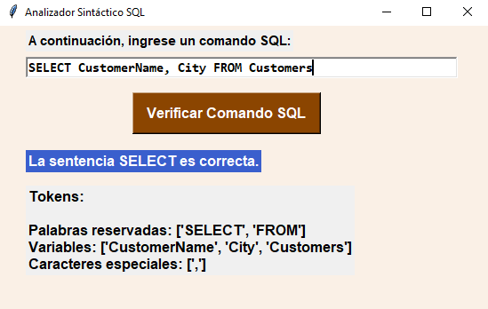

# SQL Syntax Parser
This program tokenize a given SQL query and analyze if the query is correct.

# Only recognize the following SQL commands:
- SELECT | SELECT DISTINCT
- SELECT COUNT
- DROP TABLE
- TRUNCATE TABLE
- DELETE FROM

# Screenshot
